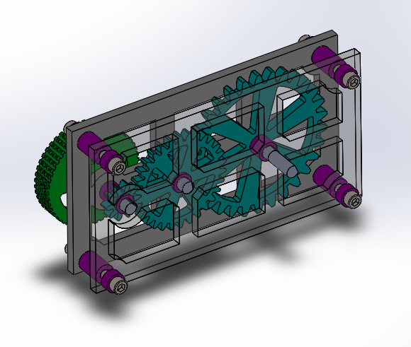
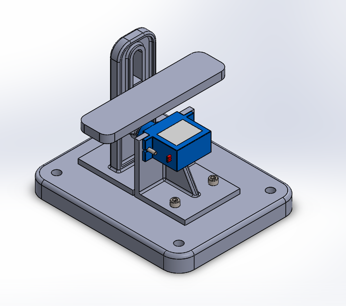
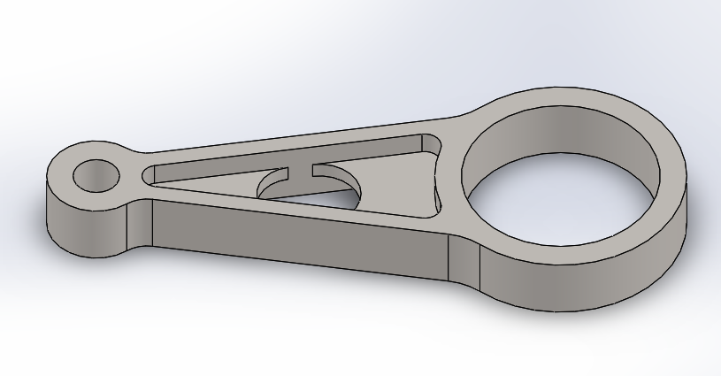

# Advanced-CAD
Meg Advanced CAD

https://github.com/chssigma/Markdown_Cheatsheet

http://wiki.chssigma.com/index.php?title=User:Mgist56

## Gears
First Advanced CAD; learning gear terminology, CAD configurations, and CAD equations.
### Resources

### Images

### Takeaways
When making a circular pattern for patterning teeth around the gear, select the circular curve of the outermost circle as the direction. The system of labeling each individual configuration with the module and the number of teeth is a simple way to not get the gears mixed up during assembly and can be applied to other configured parts. 

## Gearbox
Second Advanced CAD; assembling gears with gear mates.
### Resources

### Images

### Takeaways
Physically sketching out the placement of the gears and their relation to the plate for the plate’s dimensions makes determining said dimensions much easier. Right clicking Equations for Manage Equations and using the dimensions there is also useful. When finally assembling the gears together using gear mates, suppress the mates temporarily to position the gears correctly. Unsuppress after they are aligned and the gears will turn without the teeth moving through each other.

## Motion Study
Third Advanced CAD; making a motion study to simulate a servo powering an assembly.
### Resources

### Images

### Takeaways
The green gravity apple is not actually green, it is grey. The clip should be oriented in the final assembly with the two outer faces of the tabs mated coincident to the long rectangular faces on the inside of the slot of the bracket. Although I did not color my parts of this particular assignment, making each component unique makes them easier to differentiate and assemble especially when there are many parts that look the same.

## Stress Analysis
Fourth Advanced CAD; modifying a part with a Factor of Safety (FOS) between 1 and 2.
### Resources

### Images

### Takeaways
When changing the triangular extruded cut to “through all” to test the modified design, suppress the mirror so that you have the mirror for future reference and so that Solidworks doesn’t yell at you. Copying and pasting sketches to make a cut through another is one of the more useful features in this assignment. However, re-adding relations to the pasted sketch is necessary. Looking at resources to get an idea of how the thin parts of the part should be supported is a good idea.

## Assignment Template

### Resources

### Images

### Takeaways
